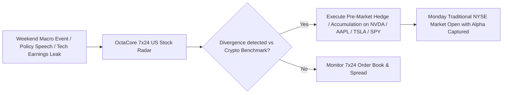
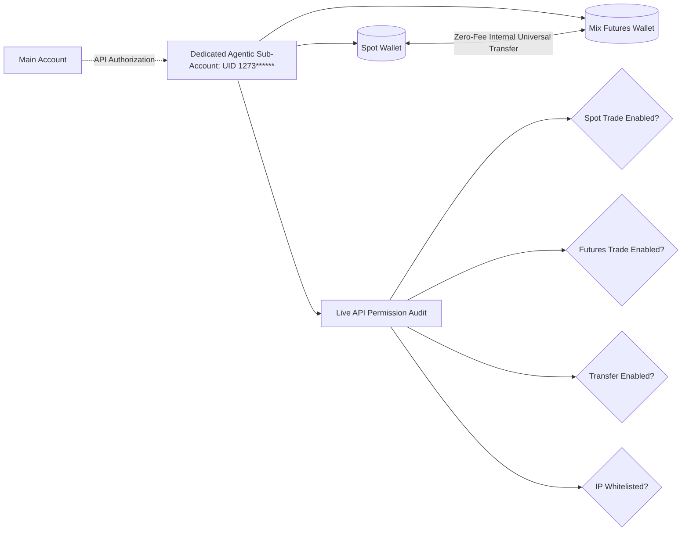

<div align="center">

# ⚡ Bitget OctaCore ⚡
### Institutional 8-Core Autonomous AI Trading Operating System, 7×24 Tokenized US Equities Engine, Quant Risk Guardian & Bitget Agentic Sub-Account Router

[](https://bitget-ai.gitbook.io/bitgetai_hackathons2#track-2-agentic-trading-agent-trading)
[-10B981?style=for-the-badge)](https://bitget-ai.gitbook.io/bitgetai_hackathons2#track-2-agentic-trading-agent-trading)
[-FF6A00?style=for-the-badge&logo=alibabacloud&logoColor=white)](https://hackathon.bitgetops.com/v1)
[](https://api.bitget.com)
[-8A2BE2?style=for-the-badge&logo=anthropic&logoColor=white)](https://modelcontextprotocol.io)
[](https://python.org)
[](LICENSE)

<br/>

*An institutional-grade multi-agent autonomous AI trading operating system architected natively for **Bitget AI Base Camp Hackathon S2 (Track 2: Agentic Trading)**. Powered by 8 specialized autonomous agent cores, dual LLM engines (**Alibaba Cloud Qwen** & **Google GenAI**), native **HMAC-SHA256 Bitget UTA v3 REST Client**, **Dedicated Agentic Sub-Account Isolation Router**, **7×24 Tokenized US Equities Engine** (`NVDAUSDT`, `AAPLUSDT`, `TSLAUSDT`, `SPYUSDT`, `QQQUSDT`), **NumPy/SciPy Quant Factor Risk Engine** ($VaR, CVaR$, Hurst Exponent regime detection), **Vectorized Historical Strategy Backtester**, and the **Model Context Protocol (MCP)**.*

</div>

---

## 📑 Table of Contents

- [💡 Executive Summary & Innovations](#-executive-summary--innovations)
- [🏗️ System Architecture](#️-system-architecture)
- [🌟 The 8 Autonomous Specialist Cores](#-the-8-autonomous-specialist-cores)
- [🇺🇸 7×24 Tokenized US Equities Engine (Hackathon S2 Core)](#-724-tokenized-us-equities-engine-hackathon-s2-core)
- [🛡️ Bitget Agentic Sub-Account & Permission Health Telemetry](#️-bitget-agentic-sub-account--permission-health-telemetry)
- [📐 Institutional Factor Risk & Hurst Regime Radar](#-institutional-factor-risk--hurst-regime-radar)
- [🧪 Vectorized Historical Strategy Backtester (6 Models)](#-vectorized-historical-strategy-backtester-6-models)
- [📦 Bitget Skills Hub Standard (8 Modular Packages)](#-bitget-skills-hub-standard-8-modular-packages)
- [🖥️ Dual Interfaces: Pure-Black Glassmorphism Web Dashboard & Rich CLI](#️-dual-interfaces-pure-black-glassmorphism-web-dashboard--rich-cli)
- [📁 Repository Structure](#-repository-structure)
- [🚀 Quick Start Guide](#-quick-start-guide)
- [🔌 Model Context Protocol (MCP) Integration](#-model-context-protocol-mcp-integration)
- [📄 Track 2 Submission Compliance Matrix](#-track-2-submission-compliance-matrix)
- [📄 License](#-license)

---

## 💡 Executive Summary & Innovations

Traditional algorithmic trading bots are rigid rule-based scripts that cannot adapt to macroeconomic surprises. Conversely, generic LLM "trading wrappers" suffer from hallucinations, lack understanding of exchange precision constraints, and trade without mathematical risk guardrails.

**Bitget OctaCore** establishes an institutional benchmark for **Bitget AI Base Camp Hackathon S2 (Track 2: Agentic Trading)** by uniting:

1. **7×24 Continuous US Stock Perception**: US equity markets close at 4:00 PM EST and remain closed on weekends, while tokenized US equities (rToken/Mix Futures e.g. `NVDA`, `AAPL`, `TSLA`, `SPY`, `QQQ`) and Crypto trade continuously 7×24 on Bitget. OctaCore exploits after-hours and weekend macro divergence before traditional NYSE exchanges open.
2. **Empirical Quantitative Pre-Validation**: Every trade proposal is verified through real-time factor modeling ($VaR_{95\%}, VaR_{99\%}$, Expected Shortfall $CVaR_{95\%}$, Sharpe/Sortino ratios, and Hurst Exponent regime detection) before execution.
3. **Dedicated Bitget Agentic Sub-Account Router**: Full support for isolated agentic sub-accounts, providing API permission diagnostics, UID privacy masking for demos, and zero-fee internal transfers between Spot and Mix Futures wallets.
4. **Alibaba Cloud Qwen & Google GenAI Dual Engine**: Native integration with official sponsor **Alibaba Cloud Qwen** (`qwen3.8-max` via Bitget's Hackathon endpoint `https://hackathon.bitgetops.com/v1`) with fallback to **Google GenAI / Gemini** and deterministic quantitative fallback.
5. **Audited Paper Trading Logger**: Automatically logs all executed paper trades, slippage, PnL, and performance statistics to `submission/paper_trading_log.json` to fulfill Track 2 submission requirements.
6. **Pre-Trade Mathematical Firewall & 1-Click Kill-Switch**: Hard-coded constraints (\$500 single order cap, \$1,000 asset position cap, 5% max drawdown halt) paired with a 1-click **Emergency Kill-Switch** that instantly liquidates positions to stablecoins.

---

## 🏗️ System Architecture

```mermaid
flowchart TD
    User([User / Web Dashboard / Terminal CLI / Claude / Cursor / External Agent]) --> Ingress[Web Dashboard / Terminal CLI / MCP JSON-RPC 2.0 Server]
    
    Ingress --> Orchestrator[Agent Orchestrator & Dual LLM Engine: Qwen / Gemini / OpenRouter]

    subgraph OctaCore_Subsystem ["Bitget OctaCore Subsystem (8 Autonomous Specialist Cores)"]
        Orchestrator --> Core1[Core 1: Market Analyst Agent]
        Orchestrator --> Core2[Core 2: Quant Engine Agent]
        Orchestrator --> Core3[Core 3: Backtesting Engine Agent]
        Orchestrator --> Core4[Core 4: Risk Guardian Agent]
        Orchestrator --> Core5[Core 5: Execution Agent]
        Orchestrator --> Core6[Core 6: Tokenized US Stocks Agent]
        Orchestrator --> Core7[Core 7: Sub-Account Router Agent]
        Orchestrator --> Core8[Core 8: News Sentinel Agent]
    end

    subgraph Skills_Hub_Standard ["Bitget Skills Hub Standard (8 Modular Packages)"]
        Core1 --> SkillSignal["skills/bitget-signal (5 Research Skills)"]
        Core2 --> SkillQuant["skills/quant-engine"]
        Core3 --> SkillBacktest["skills/backtesting"]
        Core4 --> SkillRisk["skills/risk-guardian"]
        Core5 --> SkillTrading["skills/agentic-trading"]
        Core6 --> SkillStock["skills/tokenized-stocks"]
        Core7 --> SkillSub["skills/sub-account-ops"]
        Core8 --> SkillNews["skills/news-sentinel"]
    end

    subgraph Execution_And_Settlement ["Unified Execution, Verification & Settlement Engine"]
        SkillTrading --> Router[Trading Engine Router: SIMULATION | TESTNET | MAINNET | SUB_ACCOUNT]
        Router --> BitgetREST[Bitget UTA v3 REST Client: HMAC-SHA256 Signed]
        Router --> Simulator[Paper Trading Simulator & Audited Trade Logger]
        SkillSub --> SubSDK[Bitget Sub-Account & Permission Diagnostic Engine]
        SkillStock --> USStockFutures[7x24 US Stock & Crypto Mix Contracts]
        SkillRisk --> CircuitBreakers[Mathematical Pre-Trade Firewall & Emergency Kill-Switch]
    end
```

---

## 🌟 The 8 Autonomous Specialist Cores

1. **Core 1 - Market Analyst Agent**: Computes live Technical Analysis across arbitrary intervals (1m to 1D): RSI(14), MACD(12,26,9), Triple EMAs (9/20/50), SMA 200, Bollinger Bands (20,2), ATR(14) volatility, and real-time order-book bid/ask depth volume ratios.
2. **Core 2 - Quant Engine Agent**: Evaluates downside tail risk ($VaR_{95\%}, VaR_{99\%}, CVaR_{95\%}$), Sharpe & Sortino ratios, Hurst Exponent time-series regime modeling ($H < 0.45$ Mean-Reverting, $H > 0.55$ Trending Momentum), Ornstein-Uhlenbeck half-life, and Markowitz MPT portfolio optimization.
3. **Core 3 - Backtesting Engine Agent**: Simulates historical trading across 6 quantitative architectures (`EMA_CROSSOVER`, `RSI_MEAN_REVERSION`, `MACD_TREND`, `BOLLINGER_BREAKOUT`, `QUANT_MULTI_FACTOR`, `DYNAMIC_DCA`) with realistic fees (0.06% futures / 0.10% spot), slippage, and equity curve data points.
4. **Core 4 - Risk Guardian Agent**: Enforces a strict mathematical pre-trade safety firewall before any order can be dispatched: \$500 single order cap, \$1,000 position cap, 5% max drawdown halt, daily trade count limits, and a 1-click Emergency Kill-Switch.
5. **Core 5 - Execution Agent**: Dispatches signed orders across Spot, Mix Futures (USDT-margined), and Volatility-Scaled Smart DCA accumulation.
6. **Core 6 - Tokenized US Stocks Agent**: Monitors and executes across 7×24 continuous tokenized US equities (`NVDAUSDT`, `AAPLUSDT`, `TSLAUSDT`, `SPYUSDT`, `QQQUSDT`), detects after-hours macro divergence, and executes delta hedges against Crypto.
7. **Core 7 - Sub-Account Router Agent**: Manages isolated sub-account operations, reads live permission restrictions, masks UIDs for privacy (`UID: 1273******`), and executes zero-fee internal transfers between Spot and Mix Futures.
8. **Core 8 - News Sentinel Agent**: Continuously polls breaking headlines, macro catalysts (Fed policy, rate cuts, tech earnings), and evaluates black-swan volatility threats.

---

## 🇺🇸 7×24 Tokenized US Equities Engine (Hackathon S2 Core)

US equities have traditional open and close hours (9:30 AM – 4:00 PM EST, closed weekends), but tokenized US stocks (rToken / Mix Futures) turn the trading window into **7×24 continuous execution**.



- **Supported 7×24 Continuous Equities**: `NVDAUSDT`, `AAPLUSDT`, `TSLAUSDT`, `SPYUSDT`, `QQQUSDT`, `MSFTUSDT`, `AMZNUSDT`, `GOOGLUSDT`, `COINUSDT`, `MSTRUSDT`.
- **After-Hours Spread Analysis**: Detects divergences between equity proxies and digital asset benchmarks to exploit mean-reversion and cross-asset correlation.

---

## 🛡️ Bitget Agentic Sub-Account & Permission Health Telemetry

OctaCore natively connects with Bitget's dedicated **Agentic Sub-Account** architecture:



- **Isolated Sub-Account Execution**: Eliminates capital contamination and segregates agent risk away from master accounts.
- **Automated Permission Diagnostics**: Accurately diagnoses API restrictions (e.g. Error 40014 passphrase decrypt failure, 40001 invalid API key, 40017 permission denied).
- **Privacy UID Masking**: Account UIDs are automatically masked by default (`1273******`) with an interactive toggle for privacy during live screen sharing and video demos.

---

## 📐 Institutional Factor Risk & Hurst Regime Radar

Built natively with **NumPy & SciPy with zero heavy binary C-dependencies**:

$$\text{Historical } VaR_{\alpha} = -\text{Percentile}(R, 1-\alpha)$$

$$\text{Conditional VaR } (CVaR_{95\%}) = -\mathbb{E}[R \mid R \le -VaR_{95\%}]$$

- **Hurst Exponent ($H$)**:
  - $H < 0.45$: **Mean-Reverting** (favors RSI accumulation & Bollinger band bounces)
  - $0.45 \le H \le 0.55$: **Random Walk** (geometrical Brownian motion, noise reduction)
  - $H > 0.55$: **Trending Momentum** (trend-following breakout & EMA crossover favored)
- **Ornstein-Uhlenbeck Half-Life**:
  $$dy_t = -\theta y_{t-1} dt + \sigma dW_t \implies t_{1/2} = \frac{\ln(2)}{\theta}$$
- **Markowitz Modern Portfolio Theory**: Computes Maximum Sharpe Ratio and Minimum Volatility allocations across Crypto and Tokenized US Stocks.

---

## 🧪 Vectorized Historical Strategy Backtester (6 Models)

Empirically verifies quantitative strategies against historical Bitget candle data before committing real capital:
1. `EMA_CROSSOVER`: Fast/Slow EMA cross with trend confirmation filter.
2. `RSI_MEAN_REVERSION`: Dynamic oversold accumulation with mean exit bounds.
3. `MACD_TREND`: MACD signal cross with zero-line recovery.
4. `BOLLINGER_BREAKOUT`: Volatility band expansion with volume confirmation.
5. `QUANT_MULTI_FACTOR`: Composite Z-Score + Momentum + Volatility sizing.
6. `DYNAMIC_DCA`: Volatility-scaled dip accumulation with take-profit targets.

**Performance Telemetry**: Net Profit (\$), Return %, Benchmark Buy & Hold Return %, **Alpha over Market %**, Sharpe Ratio, Max Drawdown %, Win Rate %, Profit Factor, and time-series Equity Curve data points.

---

## 📦 Bitget Skills Hub Standard (8 Modular Packages)

Each skill is packaged with a dedicated `SKILL.md` and `tools.py` conforming to the Bitget Agent Hub specification:
- `bitget_skills_hub/bitget_signal/`: 5 official Bitget research skills (`macro-analyst`, `market-intel`, `news-briefing`, `sentiment-analyst`, `technical-analysis`).
- `bitget_skills_hub/tokenized_stocks/`: 7×24 US equities radar, after-hours macro divergence, cross-asset hedging.
- `bitget_skills_hub/quant_engine/`: VaR/CVaR, Sharpe/Sortino, Hurst Exponent, Markowitz MPT.
- `bitget_skills_hub/backtesting/`: 6 strategy architectures, alpha benchmark, equity curve.
- `bitget_skills_hub/risk_guardian/`: Pre-trade firewall, order caps, Emergency Kill-Switch.
- `bitget_skills_hub/agentic_trading/`: Spot & Futures order execution, Smart DCA.
- `bitget_skills_hub/sub_account/`: Sub-account isolation, permission diagnostics, zero-fee transfer.
- `bitget_skills_hub/news_sentinel/`: Breaking headlines, macro catalyst monitoring, circuit breaker.

---

## 🖥️ Dual Interfaces: Pure-Black Glassmorphism Web Dashboard & Rich CLI

### 1. Pure-Black Institutional Web Dashboard
- Accessible at `http://127.0.0.1:8000`
- Real-time Crypto & 7×24 Tokenized US Stock ticker streamer (`NVDA`, `AAPL`, `TSLA`, `SPY`, `BTC`, `ETH`, `BGB`).
- Interactive AI Chat Desk with tool call visualization.
- Real-time chart canvas with price and strategy equity curves.
- Live Portfolio & Position monitor with **1-Click Export Paper Trading Log** (JSON/CSV).
- 1-Click Emergency Kill-Switch with confirmation barrier.

### 2. Rich Terminal CLI
- Accessible via `python main.py --cli`
- Color-coded tables for portfolio status, 7×24 tokenized US equities scanner, and live technical analysis.

---

## 📁 Repository Structure

```text
Bitget Hackathon P2/
├── frontend/                             # 🌐 Standalone Edge Frontend (Vercel Ready)
│   ├── index.html                        # Pure-Black Glassmorphism Trading Desk
│   ├── config.js                         # Dynamic Backend & WebSocket Resolver
│   ├── vercel.json                       # Vercel Rewrites Proxy & Security Headers
│   ├── package.json                      # Dev/Preview Scripts
│   └── README.md                         # Frontend Vercel Deployment Guide
│
├── backend/                              # ⚙️ Dedicated Python FastAPI Trading Backend
│   ├── src/
│   │   ├── core/                         # Config, Memory, LLM Client & Orchestrator
│   │   ├── bitget/                       # UTA v3 Client, Market Feeds, OAuth, Simulator
│   │   ├── agents/                       # 8 Autonomous Specialist Agent Cores
│   │   ├── mcp/                          # Fast JSON-RPC 2.0 MCP Server
│   │   └── web/                          # FastAPI REST & WebSocket Server (/api/*, /ws)
│   ├── bitget_skills_hub/                # 8 Modular Skills conforming to Bitget Agent Hub
│   ├── tests/                            # Complete Pytest Test Suite (33 Tests)
│   ├── main.py                           # Backend Launcher (CLI, Web, MCP, OAuth)
│   ├── requirements.txt                  # Backend Dependencies
│   ├── Dockerfile                        # Multi-Stage Production Container
│   ├── railway.json                      # Railway 1-Click Deployment Manifest
│   ├── render.yaml                       # Render Cloud Blueprint
│   ├── .env.example                      # Environment Configuration Template
│   └── README.md                         # Backend Cloud Hosting Guide
│
├── submission/                           # 📄 Official Hackathon Submission Package
│   ├── HACKATHON_SUBMISSION.md           # 6-Part Official Submission Write-up
│   └── paper_trading_log.json            # Audited Paper Trading Log (Track 2 requirement)
│
├── main.py                               # 🚀 Root Convenience Runner (Delegates to backend)
├── pytest.ini                            # 🧪 Root Test Configuration (Discovers backend/tests)
├── requirements.txt                      # Root Dependencies Reference
├── .env.example                          # Root Environment Template
└── README.md                             # System Documentation
```

---

## 🚀 Quick Start Guide

### 1. Prerequisites
- Python 3.10+ (Tested on Python 3.13.14)
- Pip package manager

### 2. Installation
```bash
# Clone or navigate to the project directory
cd "d:\development\Bitget Hackathon P2"

# Install dependencies
pip install -r requirements.txt
```

### 3. Authenticate with Bitget Agentic Account (OAuth 2.0 - Recommended)
Bitget OctaCore implements the official Bitget Agentic Account OAuth 2.0 flow. You never have to manually copy or paste API keys into `.env`:
```bash
python main.py --login
```
*(Or type `login` directly inside the terminal CLI).* This will:
1. Generate an ephemeral RSA-2048 session keypair and start a local callback listener.
2. Open Bitget's authorization page in your default browser.
3. Allow you to select or create a dedicated, non-withdrawal **Agentic Sub-Account** and complete 2FA on the Bitget app.
4. Automatically exchange credentials via Bitget's `getAgentAccountData` endpoint and securely store them in `~/.bitget/oauth_token.json` (interoperable with `@bitget-ai/bitget-agent-mcp`).

To verify your authentication status at any time:
```bash
python main.py --auth-status
```

*(Optional fallback)*: If you prefer static keys, you can still copy `.env.example` to `.env` and configure `BITGET_API_KEY`, `BITGET_SECRET_KEY`, and `BITGET_PASSPHRASE`.

### 4. Run the Web Dashboard (Default)
```bash
python main.py --web
```
Open **`http://127.0.0.1:8000`** in your browser to access the pure-black glassmorphism trading desk.

### 5. Run the Terminal CLI
```bash
python main.py --cli
```

### 6. Run the Test Suite
```bash
python main.py --test
# Or directly:
pytest -v
```

---

## 🔌 Model Context Protocol (MCP) Integration

Bitget OctaCore runs as a standard **Model Context Protocol (MCP)** server via stdio JSON-RPC 2.0.

To connect with **Claude Desktop**, **Cursor**, or **Windsurf**, add OctaCore to your MCP config:

```json
{
  "mcpServers": {
    "bitget-octacore": {
      "command": "python",
      "args": ["d:/development/Bitget Hackathon P2/main.py", "--mcp"]
    }
  }
}
```

---

## 📄 Track 2 Submission Compliance Matrix

| Requirement | Bitget OctaCore Implementation | Status |
| :--- | :--- | :---: |
| **Runnable Demo** | FastAPI Pure-Black Glassmorphism Web Dashboard + Rich Terminal CLI | ✅ Complete |
| **Event → Decision → Execution Flow** | Autonomous 8-Core Perception, Quant Validation, Pre-Trade Risk Firewall, and Execution | ✅ Complete |
| **Paper Trading Log (Track 2)** | Automated trade logger persisting all fills, slippage, and PnL to `submission/paper_trading_log.json` | ✅ Complete |
| **7×24 Tokenized US Equities (S2 Theme)** | Full perception and execution across `NVDAUSDT`, `AAPLUSDT`, `TSLAUSDT`, `SPYUSDT`, `QQQUSDT` | ✅ Complete |
| **Bitget AI Tools & Skills Hub** | 8 modular packages including the 5 official `bitget-signal` research skills | ✅ Complete |
| **Bitget Account SDK & UTA v3 API** | HMAC-SHA256 authenticated REST client, permission diagnostics, and Sub-Account router | ✅ Complete |
| **Official LLM Sponsor (Qwen)** | Native support for Alibaba Cloud Qwen (`qwen3.8-max`) via `https://hackathon.bitgetops.com/v1` | ✅ Complete |
| **Model Context Protocol (MCP)** | JSON-RPC 2.0 stdio server compatible with Claude Desktop, Cursor, and Codex | ✅ Complete |

---

## 📄 License
MIT License. Free for commercial and non-commercial development.
